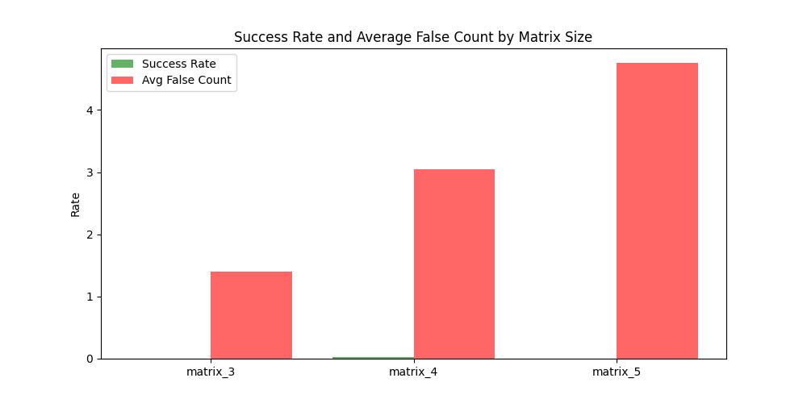

# LOOP-Evals
Logical Operations On Puzzles: Simple Iterative Reasoning Tests for LLMs first through wordgrids

# Why?
LLMs are hard to evaluate, so I wanted to test its ability to iteratively reason. The simplest version of it is whether it can create wordgrids, successively in 3x3, 4x4 and 5x5.

This is a) easy to create, and b) easy to evaluate, while still being hard to do!

# How
We ask LLMs to create word grids with minimal constraints (starting word starts with C and last word ends with N) in 3 sizes - 3x3, 4x4, and 5x5.

The test is whether they can create them. We try this over 50 attempts in the attached code, each attempt having 10 turns each, each turn using the previously generated word grid and asking it to think through and edit it such that they're valid.

# Results
Run on gpt-4-turbo-preview

